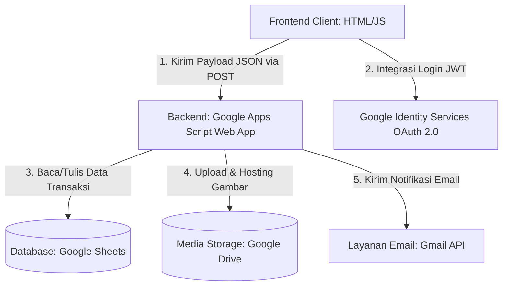

# Dokumentasi Teknis Bidding Management System (BMS)
## PT. Berlian Manyar Sejahtera (PT. BMS)

Bidding Management System (BMS) adalah platform lelang internal berbasis web untuk aset-aset perusahaan PT. Berlian Manyar Sejahtera. Sistem ini dirancang untuk memfasilitasi proses penawaran (bidding) secara transparan, aman, dan *real-time* dengan integrasi penuh menggunakan teknologi ekosistem Google.

---

## 1. Spesifikasi Tech Stack

Aplikasi ini menggunakan arsitektur **Serverless 3-Tier** dengan memanfaatkan layanan Google Cloud & Workspace sebagai backend:

1.  **Frontend (Presentation Layer)**:
    *   **Core**: HTML5 & Vanilla Javascript (ES6+) modular bebas dependencies berat.
    *   **Styling**: CSS Kustom ([asset/style.css](file:///home/urzection/Documents/bidding-app/asset/style.css)) & Tailwind CSS v3 (via Play CDN).
    *   **Autentikasi**: Google Identity Services SDK (Google One Tap & Google Sign-In button) menggunakan JWT decoding sisi client.
    *   **Sesi**: `localStorage` untuk persistensi login user.
2.  **Backend (Application Layer)**:
    *   **Google Apps Script (GAS)** dideploy sebagai Web App dengan REST API berbasis metode HTTP POST.
3.  **Database & Storage Layer**:
    *   **Google Sheets** sebagai database relasional sederhana.
    *   **Google Drive** untuk media penyimpanan gambar aset lelang.
    *   **Gmail (MailApp)** untuk pengiriman notifikasi email outbid, konfirmasi lelang, dan pemenang lelang.

---

## 2. Diagram Aliran Data & Arsitektur



---

## 3. Struktur Database (Google Sheets)

Database utama disimpan di file Spreadsheet dengan ID `1n-ZCjeVVdZKLFz1e73pvgPVugKbU22u-85ztuGBJxeU` yang terbagi ke dalam 4 sheet/tabel utama:

### 3.1. `tb_users` (Data Pengguna)
Menyimpan informasi penawar lelang yang terdaftar.
*   **Kolom**:
    *   `A: email` (Primary Key - Email Google korporat)
    *   `B: nama_lengkap` (Nama profil pengguna)
    *   `C: departemen` (Departemen kerja)
    *   `D: no_wa` (Nomor WhatsApp)
    *   `E: role` (Peran akses: `BIDDER` atau `ADMIN`)
    *   `F: status_akun` (Status akses: `AKTIF` atau `BLOKIR`)

### 3.2. `tb_assets` (Katalog Aset Lelang)
Menyimpan informasi barang/aset perusahaan yang masuk lelang.
*   **Kolom**:
    *   `A: asset_id` (Primary Key - format `AST-[TIMESTAMP]`)
    *   `B: jenis_aset` (Kategori: IT, Furniture, Kendaraan, dll.)
    *   `C: nama_aset` (Nama barang/aset)
    *   `D: deskripsi` (Keterangan kondisi fisik & spesifikasi)
    *   `E: gambar_url` (URL Gambar di Google Drive, dipisahkan tanda koma `,` jika multi-gambar)
    *   `F: harga_buka` (Harga pembuka lelang awal)
    *   `G: waktu_mulai` (Format Tanggal/Waktu mulai lelang)
    *   `H: waktu_selesai` (Format Tanggal/Waktu penutupan lelang / deadline)
    *   `I: status_lelang` (Status kontrol lelang: `OPEN` atau `CANCEL`)

### 3.3. `tb_bids` (Histori Transaksi Penawaran)
Mencatat setiap transaksi bid yang masuk.
*   **Kolom**:
    *   `A: bid_id` (Primary Key - format `BID-[TIMESTAMP]`)
    *   `B: timestamp` (Waktu pengajuan bid)
    *   `C: asset_id` (Foreign Key ke `tb_assets`)
    *   `D: email` (Foreign Key ke `tb_users`)
    *   `E: nominal_bid` (Jumlah penawaran rupiah)
    *   `F: status_bid` (Status keabsahan: `VALID` atau `CANCELLED`)

### 3.4. `view_active_bids` (Query View Real-time)
Tabel virtual yang mengkalkulasi penawaran tertinggi secara otomatis menggunakan formula Apps Script / Google Sheets.
*   **Kolom**:
    *   `A: ID Aset` | `B: Nama Aset` | `C: Kategori` | `D: Harga Buka` | `E: Bid Tertinggi Saat Ini` | `F: Email Pemenang` | `G: Nama Pemenang` | `H: Departemen` | `I: No. WhatsApp` | `J: Sisa Waktu / Status`

---

## 4. Rute REST API Backend (Google Apps Script)

Semua request dari Frontend dikirim via metode **HTTP POST** ke endpoint Apps Script (`doPost(e)`). Format request berupa JSON dengan properti `action` yang bertindak sebagai *router*.

Berikut rincian parameternya:

| Action | Payload Parameter | Pengguna | Deskripsi |
| :--- | :--- | :--- | :--- |
| `login` | `{ email }` | Semua | Memeriksa eksistensi akun dan status keaktifan user. |
| `register` | `{ email, nama_lengkap, departemen, no_wa }` | Semua | Mendaftarkan pengguna baru dengan role default `BIDDER`. |
| `getAssets` | *(none)* | Semua | Mengambil semua aset beserta status bid tertinggi saat ini. |
| `submitBid` | `{ assetId, email, nominal }` | Bidder | Mengajukan tawaran harga baru untuk aset tertentu. |
| `getUserBids`| `{ email }` | Bidder | Mengambil riwayat bid yang pernah diajukan oleh pengguna terkait. |
| `cancelBid` | `{ assetId, adminEmail }` | Admin | Membatalkan penawaran tertinggi saat ini untuk aset tertentu. |
| `addAsset` | `{ adminEmail, data: { nama, kategori, deskripsi, hargaBuka, waktuMulai, waktuSelesai }, images: [base64_strings] }` | Admin | Menambah aset lelang baru dan mengunggah gambar ke Drive. |
| `editAsset` | `{ adminEmail, assetId, data: { ... }, images: [base64_strings] }` | Admin | Memperbarui data informasi aset lelang yang ada. |
| `deleteAsset`| `{ adminEmail, assetId }` | Admin | Menonaktifkan lelang aset (mengubah status menjadi `CANCEL`). |
| `getUsers` | `{ adminEmail }` | Admin | Mengambil daftar seluruh pengguna terdaftar di sistem. |
| `updateUser` | `{ adminEmail, targetEmail, role, status }` | Admin | Memperbarui hak akses (`role`) atau status keaktifan pengguna (`status_akun`). |

---

## 5. Alur & Metode Pengiriman Email (Deep Dive Developer)

Layanan email memanfaatkan API internal Google Workspace, yaitu `MailApp` yang terintegrasi secara bawaan (*native*) pada Google Apps Script. 

### 5.1. Mekanisme Pengiriman & Otorisasi
*   **Akun Pengirim**: Email dikirim menggunakan identitas Gmail milik **developer/admin yang mendeploy Web App** Google Apps Script tersebut (akun yang memicu dialog izin/otorisasi OAuth pertama kali).
*   **Metode Pengiriman**: Menggunakan fungsi `MailApp.sendEmail(options)`.
*   **Format Konten**: Menggunakan HTML murni untuk rendering antarmuka email yang modern, responsif, dan rapi sesuai template di `EmailTemplates`.

### 5.2. Penyematan Logo Perusahaan secara Inline (`inlineImages` & `cid`)
Untuk menampilkan logo perusahaan tanpa memicu peringatan keamanan browser atau pemblokiran gambar eksternal di aplikasi email client (seperti Outlook/Gmail), sistem menggunakan metode **Content ID (`cid`)**:
1.  **Pengambilan Gambar**: Gambar `"Logo-Berlian-Manyar-Sejahtera.png"` dicari di Google Drive admin melalui `DriveApp.getFilesByName()` dan dikonversi menjadi tipe data **Blob** (Binary Large Object).
2.  **Penyematan Konten**: Blob gambar dimasukkan ke dalam objek opsi pengiriman dengan kata kunci `inlineImages`:
    ```javascript
    const options = {
      to: to,
      subject: subject,
      htmlBody: html,
      inlineImages: {
        logo: logoBlob // Berkas gambar dikirim sebagai bagian dari lampiran email terenkripsi
      }
    };
    ```
3.  **Pemanggilan di HTML**: Di dalam struktur kode HTML template email, logo dipanggil menggunakan tag source khusus: ``.

---

## 6. Mekanisme Refresh & Sinkronisasi Data (Client-Side)

Aplikasi frontend lelang menggunakan sistem sinkronisasi berbasis kombinasi waktu tunggu (*cache time*) dan pengulangan visual (*countdown interval*):

### 6.1. Pengulangan Tampilan (Visual Refresh Rate): Setiap 15 Detik
Di dalam file [asset/js/ui.js](file:///home/urzection/Documents/bidding-app/asset/js/ui.js) pada fungsi `startCountdownTimer()`, terdapat timer interval latar belakang:
*   **Interval**: **15.000 ms (15 detik)**.
*   **Tujuan**: Melakukan *re-render* tampilan kartu aset (`renderAssets()`) di galeri lelang untuk memperbarui informasi hitung mundur waktu lelang (*countdown timer*) secara dinamis agar sisa hari/jam/menit/detik yang tampil di layar tetap akurat dan selaras dengan waktu komputer pengguna.

### 6.2. Masa Segar Data Server (Cache Expiry): 15 Detik
Untuk menghindari beban server akibat request API yang berlebihan, sistem menerapkan mekanisme *caching* lokal selama **15 detik** (`cacheDuration = 15000`):
*   Jika pengguna melakukan navigasi ganti tab/halaman atau menekan tombol segarkan sebelum 15 detik berlalu sejak tarikan data terakhir, aplikasi akan menggunakan data yang tersimpan di memori lokal (`this.rawAssets`) tanpa memanggil server Apps Script.
*   Jika sudah melewati 15 detik, aplikasi otomatis melakukan tarikan data baru (*fetch*) langsung ke endpoint `getAssets` server untuk mendapatkan nominal bidding tertinggi terupdate.

---

## 7. Fitur Penjadwalan & Trigger Otomatis (Cron Job)

Sistem menggunakan fungsi `checkAndNotifyClosedAssets()` untuk memantau waktu berakhirnya lelang:

### 7.1. Cara Kerja Pengecekan Deadline Otomatis
*   Saat dipanggil, fungsi ini menarik seluruh katalog aset lelang.
*   Mengecek apakah status sisa waktu aset bernilai `"CLOSED"` (lelang telah berakhir).
*   Mengecek apakah email pemenang bernilai valid (bukan `"-"` / kosong).
*   Menggunakan **`ScriptProperties`** dengan kata kunci `NOTIFIED_CLOSED_ASSETS` untuk menyimpan array berisi ID Aset yang sudah dikirimi email pemenang. Hal ini penting agar **tidak terjadi pengiriman email berulang kali** di setiap jadwal eksekusi berikutnya.
*   Jika belum pernah dikirimi email, sistem memicu pengiriman email pemenang & laporan admin secara bersamaan, lalu menambahkan ID aset tersebut ke daftar memori `ScriptProperties`.

### 7.2. Panduan Pengaturan Pemicu Terjadwal (Time-Driven Trigger)
Untuk membuat pendeteksi deadline ini berjalan secara otomatis di Google Cloud/GAS Server:
1.  Buka **Google Apps Script Editor** proyek Anda.
2.  Di panel samping kiri, klik menu **Triggers** (ikon berbentuk jam ⏰).
3.  Klik tombol **+ Add Trigger** (Tambahkan Pemicu) di pojok kanan bawah.
4.  Sesuaikan pengaturannya:
    *   **Choose which function to run**: Pilih `checkAndNotifyClosedAssets`.
    *   **Choose which deployment should run**: Pilih `Head`.
    *   **Select event source**: Pilih `Time-driven`.
    *   **Select type of time based trigger**: Pilih `Hour timer` (Pemeriksaan setiap jam) atau `Minutes timer` (Pemeriksaan setiap beberapa menit).
    *   **Select interval**: Pilih interval yang diinginkan (direkomendasikan **setiap 10-15 menit** untuk menghindari kehabisan kuota eksekusi harian pada akun Google personal, atau **setiap 1 menit** jika Anda menggunakan Google Workspace korporat).
5.  Klik **Save**.

---

## 8. Penanganan Media Gambar (Google Drive Integration)

Proses unggah gambar dilakukan secara efisien dengan metode berikut:
*   **Local Compression**: Sisi client (frontend) memanfaatkan Canvas API untuk mengompres ukuran file gambar secara lokal di komputer pengguna sebelum diconvert menjadi string Base64. Ini menghemat bandwidth pengiriman data secara drastis.
*   **Direct CDN Rendering**: File diunggah ke Google Drive dan hak aksesnya diubah menjadi publik. Untuk menghindari pemblokiran cookie pihak ketiga (*third-party cookies*) oleh browser modern saat merender gambar Drive biasa, sistem mengonversi URL-nya ke pola direct CDN Google: `https://lh3.googleusercontent.com/d/[FILE_ID]` yang jauh lebih cepat dan andal.

---

## 9. Daftar Fungsi Penting & Penjelasan (Reference Developer)

Berikut adalah daftar fungsi inti pada sistem lelang BMS yang wajib dipahami oleh developer untuk pemeliharaan atau pengembangan fitur selanjutnya:

### 9.1. Fungsi Penting Sisi Frontend Client

#### 1. `UiService.init()` (`asset/js/ui.js`)
*   **Fungsi**: Menginisialisasi seluruh sistem antarmuka pada saat halaman selesai dimuat.
*   **Peran**: Memasang tema (gelap/terang), memicu `updateSupportButtonMailto()`, meregistrasi seluruh *event listener* tombol dan form input, serta memulai timer hitung mundur melalui `startCountdownTimer()`.

#### 2. `UiService.loadActiveAssets(forceRefresh)` (`asset/js/ui.js`)
*   **Fungsi**: Mengambil data aset aktif dari API backend Apps Script.
*   **Peran**: Menangani data lelang terupdate, menghitung sisa waktu, dan memicu fungsi render visual galeri (`renderAssets`), sinkronisasi opsi dropdown bidding (`renderAssetSelectOptions`), serta memperbarui status keranjang histori bid pengguna (`renderCart`).

#### 3. `UiService.processImageToPureBase64(file)` (`asset/js/ui.js`)
*   **Fungsi**: Kompresi gambar client-side menggunakan HTML5 Canvas.
*   **Peran**: Mengurangi ukuran dimensi dan kualitas gambar secara lokal di memori sebelum berkas dikirim. Mengubah objek file gambar menjadi string Base64 murni yang ringan untuk diunggah ke server Apps Script.

#### 4. `AuthService.initGoogleSignIn()` (`asset/js/auth.js`)
*   **Fungsi**: Menginisialisasi pustaka Google Identity Services.
*   **Peran**: Membuat tombol login Google resmi dan memicu Google One Tap dialog otomatis.

#### 5. `ApiService.postRequest(action, payload)` (`asset/js/api.js`)
*   **Fungsi**: Mesin request HTTP POST global aplikasi.
*   **Peran**: Berfungsi sebagai jembatan *fetch* API ke URL Google Apps Script dengan konfigurasi CORS `no-cors` / `cors` tanpa preflight request (`OPTIONS`) demi kecepatan respon.

---

### 9.2. Fungsi Penting Sisi Backend (Google Apps Script)

#### 1. `doPost(e)` (`preview_code.gs`)
*   **Fungsi**: *Entrypoint* router API utama backend.
*   **Peran**: Menerima request HTTP POST dari client, mengurai parameter `action` dalam data JSON, mengarahkan eksekusi ke *controller* yang sesuai, dan mengembalikan respon berformat JSON.

#### 2. `BiddingController.processBid(assetId, email, nominalBid)` (`preview_code.gs`)
*   **Fungsi**: Pengendali validitas pengajuan penawaran lelang (bid).
*   **Peran**: Memvalidasi status keaktifan akun user, memastikan lelang aset masih dibuka, membandingkan nominal penawaran baru agar wajib lebih besar daripada bid tertinggi sebelumnya (+ Rp 1), menulis data transaksi baru ke sheet `tb_bids`, serta memicu pengiriman email outbid/sukses.

#### 3. `uploadBase64ImagesToDrive(images, assetId)` (`preview_code.gs`)
*   **Fungsi**: Manajer penyimpanan berkas gambar lelang.
*   **Peran**: Mendekode data string Base64 dari client menjadi blob gambar binary, mengunggahnya ke folder Google Drive PT. BMS, mengatur hak akses berkas agar dapat dibaca publik, dan mengembalikan string gabungan URL CDN `lh3.googleusercontent.com`.

#### 4. `checkAndNotifyClosedAssets()` (`preview_code.gs`)
*   **Fungsi**: Fungsi pemantau otomatis status akhir lelang (*cron job*).
*   **Peran**: Dipanggil secara berkala via Time-Driven Trigger untuk mendeteksi aset yang waktunya habis (`CLOSED`), mengirim email selamat ke pemenang lelang dan laporan detail ke Admin, serta mencatat ID aset tersebut ke `ScriptProperties` agar tidak mengirim email duplikat.

#### 5. `NotificationService.sendAlerts(...)` (`preview_code.gs`)
*   **Fungsi**: Pusat notifikasi transaksi lelang.
*   **Peran**: Membagi dan menyalurkan pengiriman email konfirmasi sukses lelang ke penawar baru, email peringatan tersalip (*outbid*) ke penawar sebelumnya, dan email log sistem ke Admin menggunakan template HTML premium.


