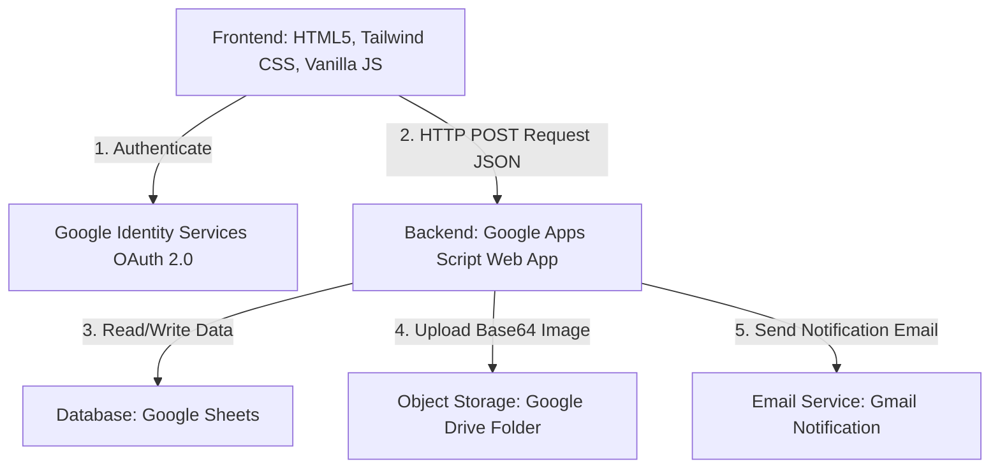

# Bidding Management System (BMS) - PT. Berlian Manyar Sejahtera

Bidding Management System (BMS) adalah platform lelang internal berbasis web untuk aset-aset perusahaan PT. Berlian Manyar Sejahtera (BMS). Sistem ini dirancang untuk memfasilitasi proses penawaran (bidding) secara transparan, aman, dan *real-time* bagi seluruh karyawan dengan integrasi penuh menggunakan teknologi ekosistem Google.

---

## 1. Arsitektur Sistem

Aplikasi ini menggunakan arsitektur **Serverless 3-Tier** dengan memanfaatkan layanan Google Cloud & Workspace sebagai backend:



1. **Frontend (Presentation Layer)**: Antarmuka berbasis Single Page Application (SPA) yang dibangun menggunakan HTML5, Tailwind CSS (via CDN), dan JavaScript murni. Mengintegrasikan Google Sign-In SDK untuk autentikasi pengguna.
2. **Backend (Application Layer)**: Ditenagai oleh **Google Apps Script (GAS)** yang dideploy sebagai Web App. Bertindak sebagai REST API Controller / Router yang menerima request POST dalam format JSON dari frontend.
3. **Database & Storage Layer**:
   - **Google Sheets** sebagai database relasional sederhana.
   - **Google Drive** sebagai media penyimpanan gambar aset lelang.
   - **Gmail (MailApp)** untuk layanan notifikasi outbid dan konfirmasi bid.

---

## 2. Struktur Database (Google Sheets)

Database disimpan di Google Sheets (ID Spreadsheet dapat disesuaikan pada konfigurasi Apps Script). Database ini terdiri dari 4 tabel/sheet utama:

### 1. `tb_users` (Daftar Pengguna)
Menyimpan data karyawan/penawar yang terdaftar.
* **Kolom**:
  - `A: email` (Primary Key - Email Google korporat)
  - `B: nama_lengkap` (Nama yang diperoleh dari profil Google)
  - `C: departemen` (Departemen kerja)
  - `D: no_wa` (Nomor WhatsApp aktif)
  - `E: role` (Peran akun: `BIDDER` atau `ADMIN`)
  - `F: status_akun` (Status akses: `AKTIF` atau `BLOCKED`)

### 2. `tb_assets` (Katalog Aset Lelang)
Menyimpan informasi barang/aset yang dilelang.
* **Kolom**:
  - `A: asset_id` (Primary Key - format `AST-[TIMESTAMP]`)
  - `B: jenis_aset` (Kategori aset)
  - `C: nama_aset` (Nama barang/aset)
  - `D: deskripsi` (Deskripsi kondisi barang)
  - `E: gambar_url` (URL gambar aset, dipisahkan koma jika lebih dari satu)
  - `F: harga_buka` (Harga awal lelang)
  - `G: waktu_mulai` (Format Tanggal/Waktu mulai lelang)
  - `H: waktu_selesai` (Format Tanggal/Waktu penutupan lelang)
  - `I: status_lelang` (Status kontrol: `OPEN` atau `CANCEL`)

### 3. `tb_bids` (Log Transaksi Penawaran)
Menyimpan histori setiap tawaran yang diajukan oleh pengguna.
* **Kolom**:
  - `A: bid_id` (Primary Key - format `BID-[TIMESTAMP]`)
  - `B: timestamp` (Waktu pengajuan bid)
  - `C: asset_id` (Foreign Key ke `tb_assets`)
  - `D: email` (Foreign Key ke `tb_users`)
  - `E: nominal_bid` (Jumlah uang yang ditawarkan)
  - `F: status_bid` (Status keabsahan: `VALID` atau `CANCELLED`)

### 4. `view_active_bids` (Query View Real-time)
Tabel virtual/view yang mengkalkulasi penawaran tertinggi secara otomatis menggunakan formula Google Sheets.
* **Kolom**:
  - `A: ID Aset` | `B: Nama Aset` | `C: Kategori` | `D: Harga Buka` | `E: Bid Tertinggi Saat Ini` | `F: Email Pemenang` | `G: Nama Pemenang` | `H: Departemen` | `I: No. WhatsApp` | `J: Sisa Waktu / Status`
* **Formula A2 (ArrayFormula / Let Expression)**:
  ```excel
  =ARRAYFORMULA(
    LET(
      _bids_valid; FILTER(tb_bids!A2:F; tb_bids!F2:F = "VALID");
      _asset_ids; INDEX(_bids_valid;; 3);
      _nominal_bids; INDEX(_bids_valid;; 5);
      _emails; INDEX(_bids_valid;; 4);
      
      _max_bids; MAP(tb_assets!A2:A; LAMBDA(_id; 
        IF(_id = ""; ""; IFERROR(MAX(FILTER(_nominal_bids; _asset_ids = _id)); 0))
      ));
      
      _winner_emails; MAP(tb_assets!A2:A; _max_bids; LAMBDA(_id; _max; 
        IF(_id = ""; ""; IFERROR(INDEX(FILTER(_emails; (_asset_ids = _id) * (_nominal_bids = _max)); 1); "-"))
      ));
      
      _winner_names; IFERROR(VLOOKUP(_winner_emails; tb_users!A:B; 2; FALSE); "-");
      _winner_depts; IFERROR(VLOOKUP(_winner_emails; tb_users!A:C; 3; FALSE); "-");
      _winner_wa; IFERROR(VLOOKUP(_winner_emails; tb_users!A:D; 4; FALSE); "-");
      
      _sisa_waktu; MAP(tb_assets!H2:H; LAMBDA(_deadline;
        IF(_deadline = ""; ""; IF(_deadline < NOW(); "CLOSED"; _deadline - NOW()))
      ));
      
      _result; FILTER(
        {tb_assets!A2:C \ tb_assets!F2:F \ _max_bids \ _winner_emails \ _winner_names \ _winner_depts \ _winner_wa \ _sisa_waktu};
        tb_assets!A2:A <> ""
      );
      
      _result
    )
  )
  ```

---

## 3. Google Apps Script API (Routes & Penjelasan Kerja)

Script backend `preview_code.gs` bertindak sebagai REST API Controller. Dikarenakan batasan eksekusi cors `fetch` Google Apps Script, komunikasi dari frontend dilakukan menggunakan request **HTTP POST** dengan muatan (payload) JSON yang membawa properti `action` sebagai router.

### API Router (Fungsi `doPost(e)`)

Menerima JSON stringified di body dan mengarahkannya ke fungsi controller yang sesuai:

| Action | Payload Parameter | Pengguna | Deskripsi |
| :--- | :--- | :--- | :--- |
| `login` | `{ email }` | Semua | Memeriksa apakah user terdaftar dan akunnya berstatus `AKTIF`. |
| `register` | `{ email, nama_lengkap, departemen, no_wa }` | Semua | Mendaftarkan pengguna baru dengan role default `BIDDER`. |
| `getAssets` | *(none)* | Semua | Mengambil semua aset lelang beserta info bid tertinggi dari sheet `view_active_bids`. |
| `submitBid` | `{ assetId, email, nominal }` | Bidder | Mengajukan tawaran harga baru untuk aset tertentu. |
| `getUserBids`| `{ email }` | Bidder | Mengambil riwayat bid yang pernah diajukan oleh pengguna terkait. |
| `cancelBid` | `{ assetId, adminEmail }` | Admin | Membatalkan penawaran tertinggi saat ini untuk aset tertentu (mengubah status bid menjadi `CANCELLED`). |
| `addAsset` | `{ adminEmail, data: { nama, kategori, deskripsi, hargaBuka, waktuMulai, waktuSelesai }, images: [base64_strings] }` | Admin | Menambah aset lelang baru dan mengunggah gambar pendukung. |
| `editAsset` | `{ adminEmail, assetId, data: { ... }, images: [base64_strings] }` | Admin | Memperbarui data aset lelang yang ada. |
| `deleteAsset`| `{ adminEmail, assetId }` | Admin | Menonaktifkan aset dengan mengubah statusnya di kolom status_lelang menjadi `CANCEL`. |
| `getUsers` | `{ adminEmail }` | Admin | Mengambil daftar seluruh pengguna terdaftar di sistem. |
| `updateUser` | `{ adminEmail, targetEmail, role, status }` | Admin | Memperbarui level hak akses (`role`) atau membekukan status pengguna (`status_akun`). |

---

### Cara Kerja Komponen Backend Khusus

#### 1. Upload Gambar Base64 ke Google Drive (`uploadBase64ImagesToDrive`)
* Menerima array data gambar dalam bentuk format string Base64 dari frontend.
* Menyimpan berkas gambar ke Google Drive folder ID `1CuamVUwN3zrqiByh4TFhp9x4MVL1Avtr` (dengan mekanisme otomatis membuat folder cadangan `"BMS Bidding Images"` apabila folder utama tidak dapat diakses).
* Mengatur perizinan file agar dapat dibaca publik (`ANYONE_WITH_LINK` / domain workspace).
* Menghasilkan direct URL CDN performa tinggi menggunakan pola link: `https://lh3.googleusercontent.com/d/[FILE_ID]` untuk menghindari masalah cookies browser saat merender gambar Drive.

#### 2. Sistem Validasi Bid
Ketika penawaran masuk melalui `submitBid`:
1. Sistem memastikan status akun pengirim bid bernilai `AKTIF`.
2. Mengecek apakah lelang aset sudah dimulai (`now >= waktuMulai`) dan belum berakhir (`sisaWaktu !== CLOSED`).
3. Memvalidasi nominal tawaran baru wajib lebih tinggi daripada harga pembuka aset dan bid tertinggi saat ini.
4. Jika valid, sistem mencatat transaksi ke `tb_bids` dan mengirimkan email pemberitahuan ke penawar baru (sukses), penawar lama yang tersalip (notifikasi *outbid*), serta admin.

---

## 4. Frontend Client (Struktur Kode)

Frontend dikembangkan dengan pendekatan modular bebas dari ketergantungan framework berat.

* **`index.html`**:
  - Menyediakan tata letak Single Page Application (SPA). Halaman berpindah secara dinamis menggunakan manipulasi properti CSS `hidden` pada level section (`#login-page`, `#register-page`, `#dashboard-page`).
  - Memuat file aset CSS serta SDK eksternal (Google Identity Services untuk login OAuth).
  - Menyediakan layout responsif (tampilan desktop dengan sidebar navigasi tetap di kiri dan mobile dengan bar navigasi bawah/bawah).

* **`asset/style.css`**:
  - Berisi deklarasi kustomisasi CSS, styling transisi, animasi micro, penyesuaian font *Outfit*, serta pengaturan custom scrollbar dan toast notification.

* **`asset/js/api.js` (`ApiService`)**:
  - Modul komunikasi fetch ke URL Apps Script. Menggunakan mode `cors` dan mengirim payload JSON langsung tanpa header yang memicu preflight request (`OPTIONS`) guna meningkatkan performa API response.

* **`asset/js/auth.js` (`AuthService`)**:
  - Menginisialisasi tombol login Google dan popup One Tap.
  - Mendekode payload JWT Token secara lokal di sisi client untuk membaca profil dasar pengguna (email, nama, foto profil).
  - Mengelola sesi aktif pengguna dengan `localStorage`.

* **`asset/js/ui.js` (`UiService`)**:
  - Mengontrol render data secara dinamis ke dalam elemen DOM.
  - Dilengkapi fitur kompresi gambar berbasis HTML5 Canvas secara lokal sebelum diunggah ke server (untuk mengecilkan ukuran base64 gambar yang dikirim).
  - Menghitung sisa waktu mundur (*countdown timer*) aset lelang secara langsung di browser setiap detik.
  - Menyediakan fitur pencarian, filter harga minimum/maksimum, filter kategori, layout toggle (tampilan grid card/list), dan paginasi gallery.

---
